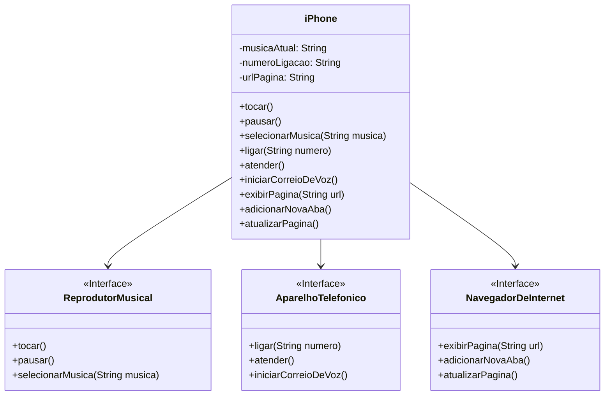

# Desafio de Análise e Implementação

O desafio proposto era colocar em prática toda a concepção de análise de negócios, requisitos, conceitos da programação orientada a objetos e modelagem UML. Com base no vídeo de lançamento do iPhone conforme link abaixo, elaborar em uma ferramenta de UML a diagramação das classes e interfaces para representar os papéis do iPhone como: Reprodutor Musical, Aparelho Telefônico e Navegador na Internet. Em seguida, criar as classes e interfaces no formato de arquivos Java.

✔️ Vamos mergulhar nessa jornada emocionante de transformação de um conceito em uma estrutura robusta de código! Aqui estão os passos que vamos seguir:

1. **Análise de Negócios e Requisitos**: Compreender as funcionalidades principais do iPhone nos três papéis mencionados.
2. **Conceitos de Programação Orientada a Objetos (POO)**: Aplicar princípios como herança, polimorfismo e encapsulamento para criar uma solução modular e reutilizável.
3. **Modelagem UML**: Utilizar uma ferramenta de UML para diagramar as classes e interfaces necessárias.
4. **Implementação em Java**: Codificar as classes e interfaces conforme o diagrama UML, garantindo que estejam prontos para representar um Reprodutor Musical, Aparelho Telefônico e Navegador na Internet.

 

💡 Vamos começar com a modelagem UML, onde definiremos claramente as interações e responsabilidades de cada componente. A seguir, partiremos para a implementação em Java, criando uma base de código sólida e eficiente. 🚀

### Video YouTube: [Lançamento iPhone 2017](https://www.youtube.com/watch?v=9ou608QQRq8)

### Funcionalidades a Modelar

1. **Reprodutor Musical**
   - Métodos:
     - `tocar()`
     - `pausar()`
     - `selecionarMusica(String musica)`
2. **Aparelho Telefônico**
   - Métodos:
     - `ligar(String numero)`
     - `atender()`
     - `iniciarCorreioDeVoz()`
3. **Navegador na Internet**
   - Métodos:
     - `exibirPagina(String url)`
     - `adicionarNovaAba()`
     - `atualizarPagina()`

### Diagrama de Classe

